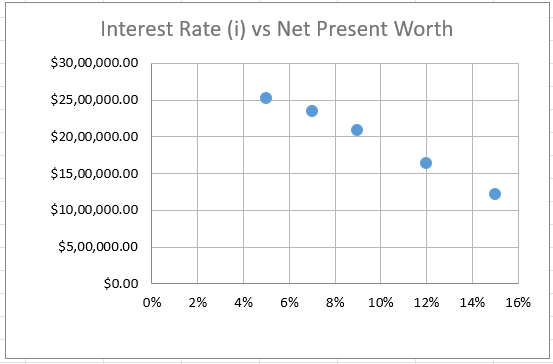
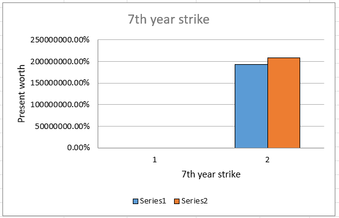

# Industrial Operations Financial Analysis

## Project Overview
This project is an financial feasibility analysis of a large-scale industrial or mining operation. It examines the costs, investments, revenue generation, and financial viability over a period of 25 years. The goal is to assess whether the project is profitable and sustainable given the expected cash flows and expenses.
Understanding the Given Data

## File Information
File Name: Industrial Operations Financial Analysis.xlsx

File Type: Microsoft Excel Spreadsheet

Purpose: To analyze financial data related to industrial operations for decision-making and performance evaluation.

## Contents
The spreadsheet consists of multiple sheets covering different aspects of financial analysis:
Income Statement: A detailed breakdown of revenue, costs, and profit margins.
Balance Sheet: Asset, liability, and equity data to assess financial health.
Cash Flow Statement: Cash inflows and outflows, operating cash, and investment insights.
Cost Analysis: Breakdown of fixed and variable costs in industrial operations.
Revenue Analysis: Revenue streams, pricing models, and demand trends.
Profitability Metrics: Gross margin, net profit, and return on investment.
Forecasting & Trends: Predictive analysis based on historical data.
KPIs & Dashboard: Key Performance Indicators visualized for quick insights.

## Graphs obtained:

